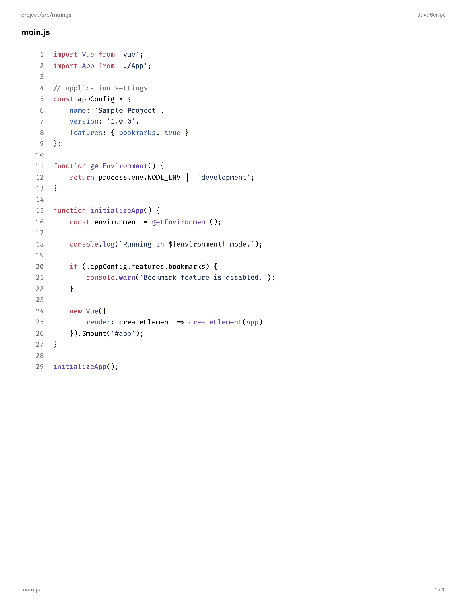
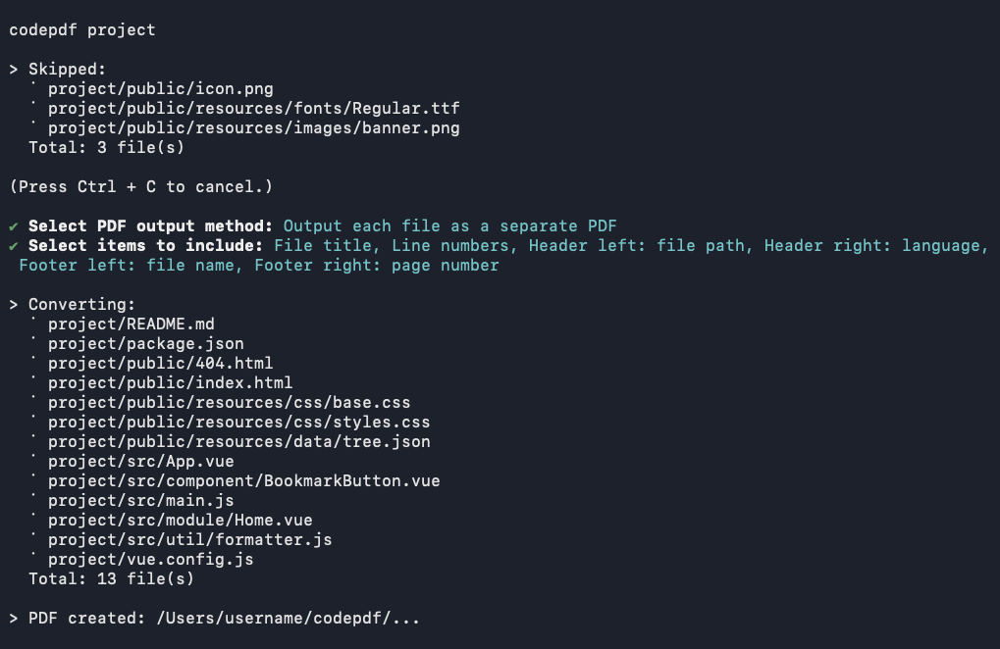
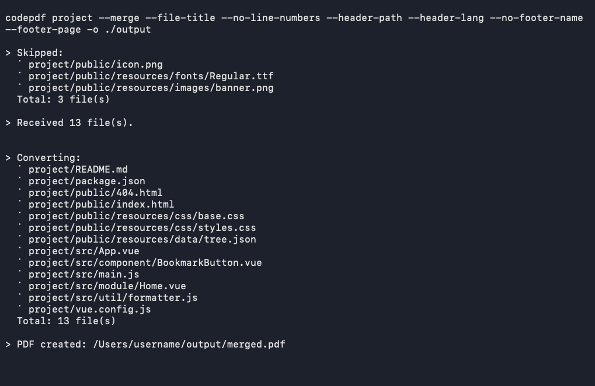

# Code-to-PDF

**Convert your code into a clean, readable PDF with syntax highlighting.**

For sharing, reviewing, printing, and keeping a record of your code.

<table style="max-width:650px;" height="130">
    <tr style="font-size:1.25rem;">
        <th style="border-bottom:none; padding: 0 15px; border-left:1px solid gray;">
            Stays private</th>
        <th style="border-bottom:none; padding: 0 15px; border-left:1px solid gray;">
            Fits any project</th>
        <th style="border-bottom:none; padding: 0 15px; border-left:1px solid gray;">
            Fully customizable</th>
    </tr>
    <tr>
        <td valign="top" style="border-top:none; padding: 8px 15px; border-left:1px solid gray;">
            Runs 100% locally - your data stays on your computer.</td>
        <td valign="top" style="border-top:none; padding: 8px 15px; border-left:1px solid gray;">
            Convert a single file or an entire directory into one merged PDF or many.</td>
        <td valign="top" style="border-top:none; padding: 8px 15px; border-left:1px solid gray;">
            Show or hide the file title, line numbers, header, and footer - your call.</td>
    </tr>
</table>
<br>



> **Requirements:** Node.js 20.11+

## Features

- Preserves directory structure when exporting separate PDFs
- Highlights syntax using the GitHub theme
- Works interactively or with command-line flags

## Installation

```bash
npm install
npm link
```

To remove the global link:
```bash
npm unlink -g code-to-pdf
```

## Usage

```bash
codepdf <paths...> [options]
```

### Examples
```bash
# Convert a single file
codepdf project/src/main.js

# Convert an entire directory
codepdf project
```
Interactive prompts:



<br>

Command-line options:



## Options

| Flag | Description |
| --- | --- |
| `-o <directory>` / `--output <directory>` | Output directory|
| `--merge` / `--no-merge` | Combine into one PDF / Export separately |
| `--file-title` / `--no-file-title` | Show/hide file name title above code |
| `--line-numbers` / `--no-line-numbers` | Show/hide line numbers |
| `--header-path` / `--no-header-path` | Show/hide file path in left header |
| `--header-lang` / `--no-header-lang` | Show/hide language tag in right header |
| `--footer-name` / `--no-footer-name` | Show/hide file name in left footer |
| `--footer-page` / `--no-footer-page` | Show/hide page number in right footer |
| `-h` / `--help` | Show help |

## License

This project is [MIT](LICENSE) licensed.

### Fonts

This project bundles the following fonts:

* **Fira Code**
    - **License:** [SIL Open Font License, Version 1.1.](https://openfontlicense.org)
    - **Copyright:** 2014-2020 The Fira Code Project Authors
    - **Source:** [Fira Code Repository](https://github.com/tonsky/FiraCode)

* **Inclusive Sans**
    - **License:** [SIL Open Font License, Version 1.1.](https://openfontlicense.org)
    - **Copyright:** 2022 The Inclusive Sans Project Authors 
    - **Source:** [Inclusive Sans Repository](https://github.com/LivKing/Inclusive-Sans)
